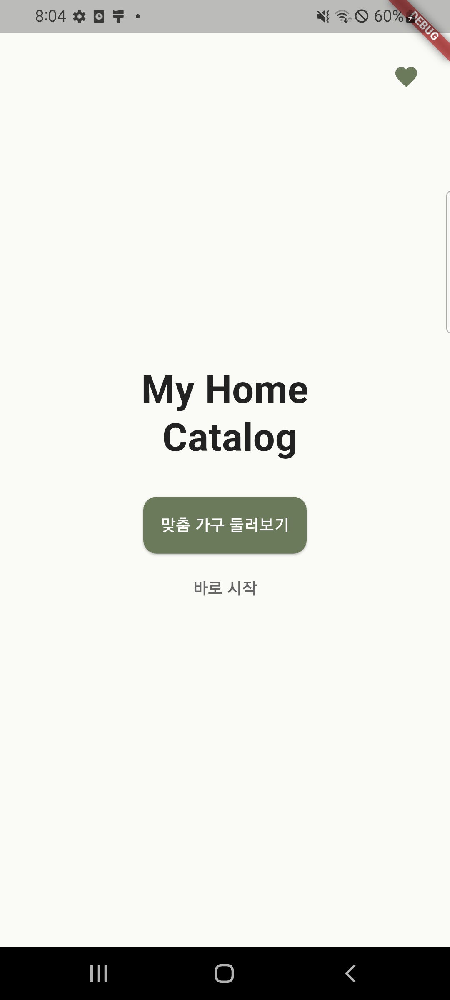
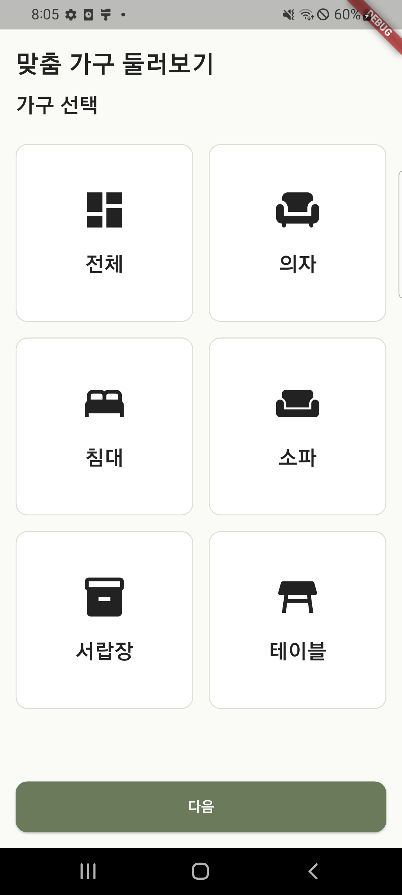
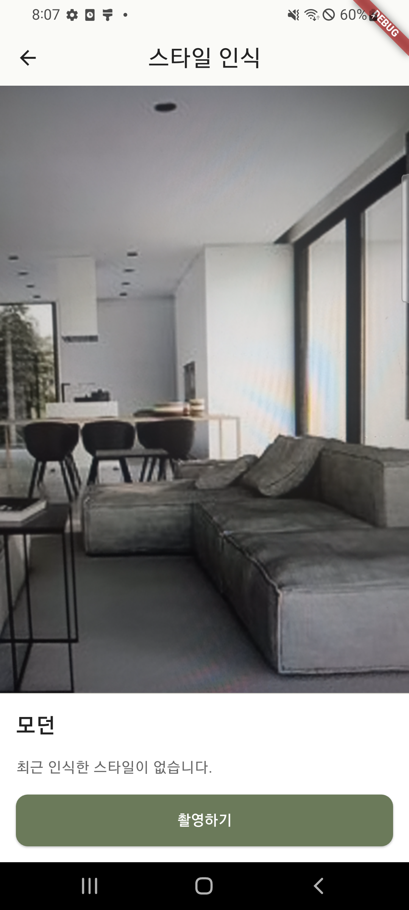
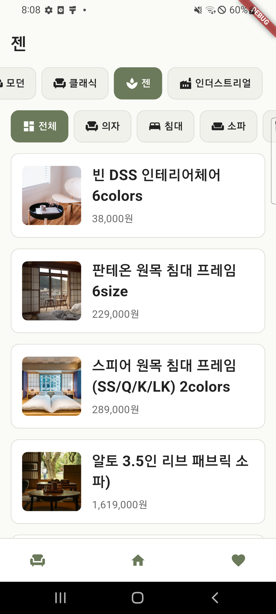
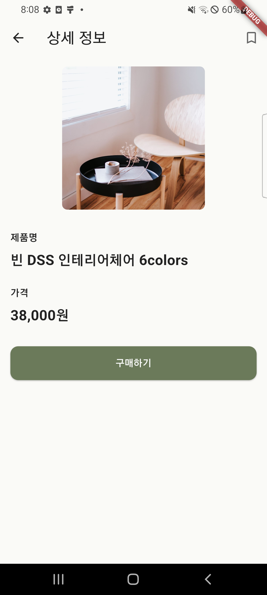
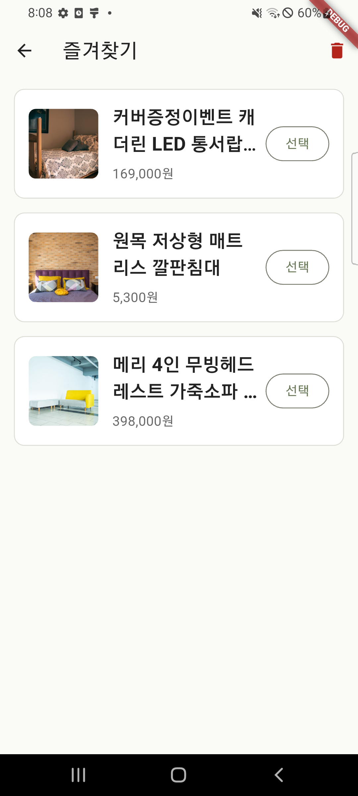
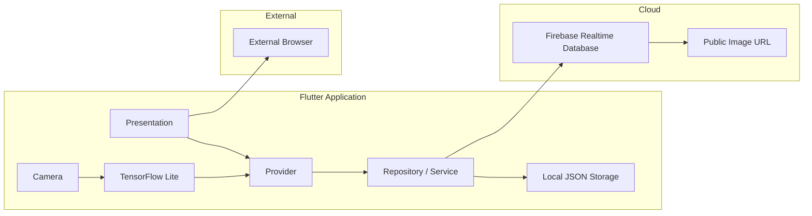

# 🏠 My Home Catalog Flutter

> **사진으로 인테리어 스타일을 분류하고, 분석 결과에 맞는 가구를 추천하는 Flutter 애플리케이션**

기존 Java 기반 Android 앱을 Flutter로 마이그레이션하여 Android와 iOS를 함께 지원하도록 재구현했습니다.
프로젝트 전반에는 기능 명세, 코딩 규칙, 검증 체크리스트를 기반으로 AI 에이전트를 통제하는 개발 방식을 적용했습니다.

---

## 📱 실행 화면

<p align="center">
  
  
  
  
</p>

<p align="center">
  
  
</p>


---

## 📌 프로젝트 개요

* **개발 형태**: 1인 개인 프로젝트
* **개발 기간**: 2026.06 ~ 2026.07
* **지원 플랫폼**: Android / iOS
* **기존 프로젝트**: Java 기반 Android Native 앱
* **마이그레이션 프로젝트**: Dart 기반 Flutter 앱

### 기획 목적

인테리어에 익숙하지 않은 사용자도 자신의 공간과 유사한 스타일을 파악하고, 해당 스타일에 맞는 가구를 쉽게 탐색할 수 있도록 이미지 분류 기반 가구 추천 앱을 기획했습니다.

기존 Android 앱은 하나의 플랫폼만 지원하고 Activity 내부에 화면 처리와 상태 관리가 집중되어 있었습니다. 이를 Flutter로 재구현하면서 Android와 iOS를 함께 지원하고, 기능별 책임을 분리한 구조로 개선했습니다.

### 개발 목표

* 기존 Android 앱의 기능과 데이터 계약 유지
* Flutter 기반 Android·iOS 크로스플랫폼 지원
* Feature First 구조와 Provider 기반 상태관리 적용
* Firebase Realtime Database 기반 추천 데이터 조회
* TensorFlow Lite를 활용한 온디바이스 스타일 분류
* 로컬 저장소 기반 즐겨찾기 및 인식 기록 관리
* 문서와 검증 기준을 활용한 AI 에이전트 개발 프로세스 구축

---

## 🔄 Android 앱 마이그레이션

| 구분     | 기존 Android 앱               | Flutter 앱                  |
| ------ | -------------------------- | -------------------------- |
| 플랫폼    | Android                    | Android / iOS              |
| 언어     | Java                       | Dart                       |
| UI 구조  | Activity 중심                | Feature First              |
| 상태관리   | Activity 내부 상태             | Provider                   |
| 원격 데이터 | Firebase Realtime Database | Firebase Realtime Database |
| 로컬 저장  | SharedPreferences / JSON   | 로컬 JSON 파일                 |
| 이미지 분류 | TensorFlow Lite            | TensorFlow Lite            |
| 화면 이동  | Intent                     | Flutter Navigator          |
| 외부 링크  | Android Intent             | url_launcher               |

기존 기능을 그대로 옮기는 것에 그치지 않고, 화면·상태·데이터 처리를 기능 단위로 분리해 유지보수하기 쉬운 구조로 개선했습니다.

---

## ✨ 핵심 기능

* 🔹 가구 종류 선택
* 🔹 카메라 프리뷰 기반 공간 촬영
* 🔹 TensorFlow Lite 기반 인테리어 스타일 분류
* 🔹 분류 결과와 가구 종류에 따른 추천 목록 조회
* 🔹 스타일 및 가구 종류 필터
* 🔹 상품 상세 정보 확인
* 🔹 외부 구매 페이지 이동
* 🔹 즐겨찾기 저장·조회·삭제
* 🔹 최근 인식 스타일 기록 조회 및 삭제
* 🔹 Android 및 iOS 환경 지원

---

## 🖥️ 화면 구성

### 초기 화면

앱의 주요 기능으로 이동할 수 있는 시작 화면입니다.

* 바로 시작
* 맞춤 가구 둘러보기
* 즐겨찾기 이동

### 가구 선택 화면

추천받고 싶은 가구 종류를 선택합니다.

* 의자
* 침대
* 소파
* 서랍장
* 테이블

가구를 선택하지 않은 상태에서는 다음 화면으로 이동하지 않도록 예외 처리를 적용했습니다.

### 스타일 인식 화면

카메라 프리뷰를 통해 공간을 촬영하고 TensorFlow Lite 모델로 인테리어 스타일을 분류합니다.

* 카메라 권한 확인
* 실시간 카메라 프리뷰
* 스타일 분류 결과 표시
* 인식 결과 기록
* 추천 목록으로 스타일과 가구 종류 전달

### 추천 목록 화면

Firebase Realtime Database에서 조건에 맞는 상품 정보를 조회합니다.

* 스타일 필터
* 가구 종류 필터
* 상품 이미지, 이름, 가격 표시
* 필터 변경 시 데이터 재조회
* 로딩, 빈 목록, 오류 상태 처리

### 상품 상세 화면

선택한 상품의 상세 정보를 확인합니다.

* 상품 이미지
* 상품명
* 가격
* 즐겨찾기 저장
* 외부 구매 링크 이동

### 즐겨찾기 화면

사용자가 저장한 상품을 로컬 저장소에서 조회합니다.

* 즐겨찾기 목록
* 상세 화면 이동
* 선택 항목 삭제
* 빈 목록 상태 처리

---

## 🧱 시스템 구조



### 주요 데이터 흐름

#### 추천 목록 조회

```text
[사용자 필터 선택]
        ↓
[MainScreen]
        ↓
[RecommendationProvider]
        ↓
[RecommendationRepository]
        ↓
[Firebase Realtime Database]
        ↓
[상품 모델 변환]
        ↓
[추천 목록 상태 갱신]
```

#### 카메라 스타일 분류

```text
[가구 종류 선택]
        ↓
[CameraScreen]
        ↓
[카메라 프레임 입력]
        ↓
[TFLite 추론]
        ↓
[신뢰도 기준 확인]
        ↓
[스타일 및 가구 종류 전달]
        ↓
[추천 목록 조회]
```

#### 즐겨찾기 저장

```text
[상품 상세 화면]
        ↓
[즐겨찾기 저장 요청]
        ↓
[Name 기준 중복 확인]
        ↓
[로컬 JSON 파일 저장]
        ↓
[FavoritesScreen 상태 갱신]
```

---

## 📂 프로젝트 구조

```text
lib/
├── app/
│   ├── router/
│   └── app.dart
├── core/
│   ├── constants/
│   ├── theme/
│   └── utils/
├── features/
│   ├── initial/
│   ├── custom/
│   ├── camera/
│   ├── home/
│   ├── detail/
│   └── favorites/
├── shared/
│   └── widgets/
├── firebase_options.dart
└── main.dart
```

* `presentation`: 화면과 사용자 이벤트 처리
* `provider`: 화면 상태 및 비즈니스 흐름 관리
* `data`: Firebase·로컬 저장소 접근
* `domain`: 화면 이동 및 도메인 규칙
* `shared/widgets`: 여러 화면에서 사용하는 공통 UI

---

## 🛠️ 기술 스택

### Client

* Flutter 3.38.3
* Dart 3.10.1
* Material 3

### 상태관리

* Provider

### 데이터

* Firebase Realtime Database
* 로컬 JSON 파일
* 공개 이미지 URL

### 온디바이스 AI

* TensorFlow Lite
* 이미지 분류 모델
* 카메라 프레임 기반 추론

### 주요 패키지

* `firebase_core`
* `firebase_database`
* `provider`
* `camera`
* `path_provider`
* `url_launcher`

### 개발 및 협업

* Git
* GitHub
* Feature Branch
* Pull Request
* Markdown 기반 개발 문서

### AI 활용 도구

* ChatGPT
* OpenAI Codex

---

## 🤖 AI 에이전트 활용 개발

이 프로젝트는 AI가 단순히 코드를 생성하도록 맡기는 방식이 아니라, **AI가 일정한 기준으로 작업할 수 있는 개발 환경을 먼저 설계하는 것**을 목표로 진행했습니다.

### 1. 프로젝트 컨텍스트 문서화

기존 Android 프로젝트와 Flutter 마이그레이션 목표를 분석해 다음 문서를 작성했습니다.

```text
docs/
├── project-overview.md
├── architecture.md
├── feature-spec.md
├── coding-rules.md
├── ai-workflow.md
├── prompt-strategy.md
├── ui-guideline.md
├── harness-checklist.md
└── development-log.md
```

각 문서는 AI 에이전트가 프로젝트 전체를 추측하지 않고, 현재 기능과 구조를 기준으로 작업하도록 만드는 컨텍스트로 사용했습니다.

### 2. 역할 분담

#### ChatGPT

* 기능 구현 순서 설계
* 작업 단위 분리
* Codex 실행 프롬프트 작성
* 브랜치 및 PR 단위 정리
* 검증 기준 구체화
* 오류 원인 분석 보조

#### Codex

* 기존 Android 코드 분석
* Flutter 기능 구현
* 코드 수정 및 리팩토링
* 변경 파일 분석
* 정적 분석 및 테스트 수행
* PR과 개발 로그 초안 작성

#### 개발자

* 프로젝트 목표와 구현 범위 결정
* 상태관리 및 폴더 구조 선택
* AI 생성 결과 검토
* 실제 기기 실행 및 사용자 흐름 검증
* 오류 해결 방향 결정
* Git 브랜치·커밋·PR 직접 관리
* 최종 코드 승인

### 3. 기능 단위 개발

전체 앱을 한 번에 생성하지 않고 기능을 나눠 구현했습니다.

```text
Initial
   ↓
Custom + Main
   ↓
Detail + Favorites
   ↓
Firebase
   ↓
Camera + TFLite
   ↓
플랫폼 검증 및 UI 개선
```

기능 단위로 범위를 제한해 AI의 컨텍스트 손실을 줄이고, 오류가 발생했을 때 원인을 빠르게 찾을 수 있도록 했습니다.

### 4. Context Engineering

각 기능을 구현할 때 다음 내용을 함께 제공했습니다.

* 기존 Android 구현
* 기능 명세
* 데이터 필드와 Firebase 경로
* UI 가이드라인
* 코딩 규칙
* 구현 금지 사항
* 완료 후 검증 방법

이를 통해 AI가 기존 프로젝트에 없는 로그인, 검색, 장바구니 등의 기능을 임의로 추가하지 않도록 통제했습니다.

### 5. Harness Engineering

AI가 생성한 결과는 `harness-checklist.md`를 기준으로 검증했습니다.

검증 항목:

* 기존 Android 기능과 동일한지
* 화면 이동 흐름이 유지되는지
* Firebase 데이터 계약이 변경되지 않았는지
* 로딩·빈 목록·오류 상태가 처리되는지
* Android와 iOS에서 동작하는지
* 카메라와 TFLite 로직이 기존 기준을 따르는지
* AI가 명세에 없는 기능을 추가하지 않았는지

### AI 활용 개발 흐름

```text
[기존 기능 분석]
        ↓
[관련 문서 확인]
        ↓
[기능 단위 프롬프트 작성]
        ↓
[Codex 코드 구현]
        ↓
[flutter analyze / flutter test]
        ↓
[실제 Android 기기 검증]
        ↓
[iOS Simulator 검증]
        ↓
[문제 수정 및 PR 기록]
```

---

## 🗂️ Firebase 데이터 구조

```json
{
  "all": {
    "natural": {
      "bed": {
        "Item_01": {
          "image": "https://...",
          "name": "상품명",
          "price": "가격",
          "link": "구매 링크"
        }
      },
      "chair": {},
      "dresser": {},
      "sofa": {},
      "table": {}
    },
    "modern": {},
    "classic": {},
    "industrial": {},
    "zen": {}
  }
}
```

`all → style → type → item` 구조로 구성해 화면의 필터 조건과 데이터 조회 경로를 일치시켰습니다.

스타일과 가구 종류가 `all`일 경우 여러 하위 경로를 순회해 데이터를 합치는 방식으로 구현했습니다.

---

## 🚨 트러블슈팅

### 1️⃣ Firebase Android 초기화 실패

**문제**

Android 에뮬레이터에서 Firebase 초기화 과정 중 다음 오류가 발생했습니다.

```text
Failed to load FirebaseOptions from resource
```

**원인**

`google-services.json` 파일은 존재했지만 Android Gradle에 Google Services 플러그인이 적용되지 않아 Firebase 설정값이 Android 리소스로 생성되지 않았습니다.

**해결**

* `android/app/google-services.json` 위치 확인
* Google Services Gradle 플러그인 등록
* 앱 모듈에 플러그인 적용
* `flutter clean` 후 재빌드

**배운 점**

→ Firebase 설정 파일을 추가하는 것만으로 연동이 완료되는 것이 아니라, 플랫폼별 빌드 시스템이 설정 파일을 처리하도록 구성해야 합니다.

---

### 2️⃣ iOS Firebase 최소 배포 버전 충돌

**문제**

iOS Simulator 실행 시 `firebase_core`가 더 높은 최소 iOS 버전을 요구해 CocoaPods 설치가 실패했습니다.

```text
firebase_core requires a higher minimum iOS deployment version
```

**원인**

`ios/Podfile`의 플랫폼 버전이 주석 처리되어 CocoaPods가 iOS 13으로 자동 설정하고 있었습니다.

**해결**

```ruby
platform :ios, '15.0'
```

을 명시하고 기존 Pods와 `Podfile.lock`을 제거한 뒤 다시 설치했습니다.

**배운 점**

→ Flutter 패키지가 지원하는 최소 플랫폼 버전과 프로젝트의 Deployment Target을 함께 관리해야 합니다.

---

### 3️⃣ Firebase Storage 무료 요금제 접근 제한

**문제**

기존 Firebase Storage 이미지 URL 요청 시 HTTP 402 오류가 발생했습니다.

**원인**

Firebase Storage 정책 변경으로 Spark 요금제 프로젝트의 기본 버킷 접근이 제한되었습니다.

**해결**

* Firebase Realtime Database의 상품 구조는 유지
* 이미지 저장소 의존성을 분리
* 공식 공개 이미지 API 기반 HTTPS 이미지 URL로 교체
* 네트워크 이미지 로딩 실패 시 대체 UI 적용

**배운 점**

→ 서비스 정책이나 비용 구조가 변경될 수 있으므로 메타데이터와 이미지 저장소의 결합도를 낮추는 설계가 필요합니다.

---

### 4️⃣ 카메라 미리보기 화면 비율 문제

**문제**

카메라 미리보기가 정사각형으로 표시되거나 실제 화면보다 가로로 늘어나 보였습니다.

**원인**

카메라의 원본 비율과 화면에 표시하는 컨테이너 비율이 일치하지 않았고, 세로 화면에서 카메라의 가로·세로 크기 계산이 올바르지 않았습니다.

**해결**

* `CameraController`의 `previewSize` 기준으로 비율 계산
* 세로 화면에서 가로·세로 방향 보정
* `BoxFit.cover`로 비율을 유지하며 중앙 기준으로 자르기
* 기존 촬영 및 추론 로직은 유지

**배운 점**

→ 카메라 프리뷰는 단순히 화면 크기에 맞추면 늘어날 수 있으므로 센서 방향과 원본 종횡비를 함께 고려해야 합니다.

---

### 5️⃣ 필터 선택 항목이 화면 밖으로 가려지는 문제

**문제**

스타일과 가구 종류 필터에서 마지막 항목을 선택하면 선택된 버튼이 화면 밖에 위치해 현재 선택 상태를 확인하기 어려웠습니다.

**해결**

* 필터를 가로 스크롤 구조로 유지
* 선택된 항목의 위치를 계산
* 선택 직후 해당 항목이 화면 안으로 이동하도록 자동 스크롤 적용
* 화면 표시용 스타일명과 가구 종류를 한글로 통일

**배운 점**

→ 선택 가능한 항목이 가로 화면을 넘어가는 경우 단순 스크롤 제공뿐 아니라 현재 선택 상태의 가시성도 함께 보장해야 합니다.

---

## ✅ 검증

기능 구현 후 아래 명령을 반복적으로 실행했습니다.

```bash
dart format lib test
flutter analyze
flutter test
flutter run
```

### 실제 환경 검증

* Android 에뮬레이터 실행
* 실제 Android 기기 실행
* 카메라 권한 및 프리뷰 확인
* TFLite 스타일 분류 확인
* Firebase 실데이터 표시 확인
* 즐겨찾기 저장·삭제 확인
* iOS Simulator 빌드 및 실행 확인
* 외부 구매 링크 이동 확인

---

## 🚀 구조 설계 및 개선 포인트

* 화면, 상태관리, 데이터 접근 책임 분리
* Firebase 호출을 Repository 계층으로 분리
* Provider를 통한 로딩·데이터·빈 목록·오류 상태 관리
* 공통 이미지 Widget을 통한 네트워크 오류 처리
* Firebase key와 사용자 표시 문자열 분리
* AI가 임의의 기능을 추가하지 않도록 명세 기반 개발
* 기능 단위 브랜치와 Pull Request로 변경 이력 관리
* 개발 로그에 문제와 해결 과정을 지속적으로 기록

---

## 🔄 향후 개선 방향

* 이미지 캐시 적용
* Widget Test 및 통합 테스트 범위 확대
* 실제 사용자 데이터 기반 추천 로직 고도화
* TFLite 모델 정확도 및 추론 속도 재측정
* 앱 아이콘과 스플래시 화면 개선
* 접근성 라벨 및 다크 모드 지원
* 운영 환경을 고려한 이미지 CDN 구축
* Android Play Store 및 iOS App Store 배포 설정

---

## 💡 이 프로젝트를 통해 얻은 역량

* Android Native 앱을 Flutter로 마이그레이션한 경험
* Android와 iOS를 함께 지원하는 앱 구조 설계
* Provider 기반 상태관리와 Feature First 구조 적용
* Firebase Realtime Database 비동기 데이터 처리
* 로컬 JSON 기반 즐겨찾기 저장 구조 구현
* Camera와 TensorFlow Lite 기반 온디바이스 추론
* Android/iOS 플랫폼별 Firebase 및 권한 설정
* AI 에이전트가 안정적으로 작업할 수 있는 컨텍스트 설계
* 체크리스트 기반 AI 생성 코드 검증
* 기능 단위 프롬프트와 Git 이력을 활용한 개발 프로세스 관리
* AI 생성 결과를 검토하고 수정 방향을 결정하는 에이전트 통제 경험