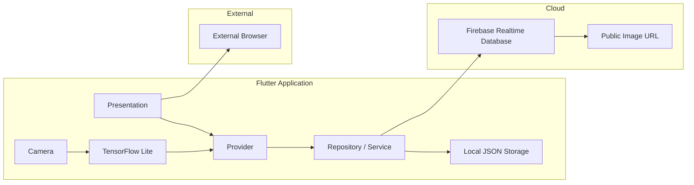

# 🏠 My Home Catalog Flutter

> **사진으로 인테리어 스타일을 분류하고, 분석 결과에 맞는 가구를 추천하는 Flutter 애플리케이션**

* **기존 프로젝트**: Java 기반 Android Native 앱
* **마이그레이션 프로젝트**: Dart 기반 Flutter 앱

---

## 📱 실행 화면

<p align="center">
  
  
  
</p>

<p align="center">
  
  
  
</p>


---

## 📌 프로젝트 개요

* **개발 형태** : 1인 개인 프로젝트
* **개발 기간** : 2026.07
* **지원 플랫폼** : Android / iOS
* **기획 목적** : 기존 Android 앱을 Flutter로 리팩토링하여 크로스플랫폼 지원 및 유지보수 가능한 구조로 개선

* **개발 목표**
  * 기존 Android 앱을 Flutter로 리팩토링하여 Android·iOS 크로스플랫폼 지원
  * Feature First 구조와 Provider 기반 상태관리 적용
  * Firebase Realtime Database와 TensorFlow Lite 연동

* **기술 스택**
  * Language: Dart
  * Framework: Flutter
  * State Management: Provider
  * Backend: Firebase Realtime Database
  * Local Storage: SharedPreferences
  * Machine Learning: TensorFlow Lite
  * Architecture: Feature-First Architecture (Repository Pattern)

---

## ✨ 핵심 기능
* 인테리어 스타일 이미지 분류
* TensorFlow Lite 기반 온디바이스 추론
* Firebase 기반 가구 추천
* 스타일 및 가구 종류 필터
* 상품 상세 조회 및 외부 구매 링크
* 즐겨찾기 및 최근 인식 기록 관리
* Android / iOS 지원

---

## 🧱 시스템 구조



---

## 📂 프로젝트 구조

```text
lib/
├── app/
│   ├── router/
│   └── app.dart
├── core/
│   ├── constants/
│   ├── theme/
│   └── utils/
├── features/
│   ├── initial/
│   ├── custom/
│   ├── camera/
│   ├── home/
│   ├── detail/
│   └── favorites/
├── shared/
│   └── widgets/
├── firebase_options.dart
└── main.dart
```

### 구조 설계
* Feature First 기반 기능 분리
* Provider를 통한 상태관리
* Repository 패턴으로 데이터 접근 분리
* 공통 Widget을 통한 UI 재사용

---

## 🤖 AI 활용 개발

이 프로젝트는 AI가 코드를 생성하도록 맡기는 방식이 아니라, **기능 명세와 검증 기준을 기반으로 AI와 협업하는 개발 방식**으로 진행했습니다.

### 개발 프로세스

```text
기존 Android 프로젝트 분석
        ↓
프로젝트 문서 작성
        ↓
기능 단위 Prompt 작성
        ↓
Codex 구현
        ↓
flutter analyze / flutter test
        ↓
Android · iOS 검증
        ↓
PR 및 개발 로그 기록
```

### 역할 분담

| 역할 | 담당 |
|------|------|
| **ChatGPT** | 기능 분석, 작업 계획 수립, 프롬프트 작성, 검증 기준 정의 |
| **Codex** | Flutter 기능 구현 및 리팩토링 |
| **Developer** | 구조 설계, 코드 검토, 테스트, 최종 승인 |

### 활용한 문서

```text
docs/
├── project-overview.md
├── architecture.md
├── feature-spec.md
├── coding-rules.md
├── ai-workflow.md
├── prompt-strategy.md
├── ui-guideline.md
├── harness-checklist.md
└── development-log.md
```

### AI 개발 원칙

- 기능 명세 기반으로 구현 범위 제한
- 기능 단위 브랜치와 PR 기반 개발
- 체크리스트 기반 코드 검증
- 기존 Android 앱과 동일한 기능 및 데이터 계약 유지

---

## 🚨 트러블슈팅

### 1️⃣ Firebase Storage 무료 요금제 접근 제한

**문제**

기존 Firebase Storage 이미지 URL 요청 시 HTTP 402 오류가 발생했습니다.

**원인**

Firebase Storage 정책 변경으로 Spark 요금제 프로젝트의 기본 버킷 접근이 제한되었습니다.

**해결**

* Firebase Realtime Database의 상품 구조는 유지
* 이미지 저장소 의존성을 분리
* 공식 공개 이미지 API 기반 HTTPS 이미지 URL로 교체
* 네트워크 이미지 로딩 실패 시 대체 UI 적용

**배운 점**

→ 서비스 정책이나 비용 구조가 변경될 수 있으므로 메타데이터와 이미지 저장소의 결합도를 낮추는 설계가 필요합니다.

---

### 2️⃣ 카메라 미리보기 화면 비율 문제

**문제**

카메라 미리보기가 정사각형으로 표시되거나 실제 화면보다 가로로 늘어나 보였습니다.

**원인**

카메라의 원본 비율과 화면에 표시하는 컨테이너 비율이 일치하지 않았고, 세로 화면에서 카메라의 가로·세로 크기 계산이 올바르지 않았습니다.

**해결**

* `CameraController`의 `previewSize` 기준으로 비율 계산
* 세로 화면에서 가로·세로 방향 보정
* `BoxFit.cover`로 비율을 유지하며 중앙 기준으로 자르기
* 기존 촬영 및 추론 로직은 유지

**배운 점**

→ 카메라 프리뷰는 단순히 화면 크기에 맞추면 늘어날 수 있으므로 센서 방향과 원본 종횡비를 함께 고려해야 합니다.

---

## 💡 이 프로젝트를 통해 얻은 역량

* Android Native 앱의 Flutter 리팩토링
* Feature First 구조와 Provider 기반 상태관리 적용
* Firebase Realtime Database와 TensorFlow Lite 연동
* Android·iOS 크로스플랫폼 개발 경험
* AI를 활용한 리팩토링 및 검증 중심 개발 프로세스 경험